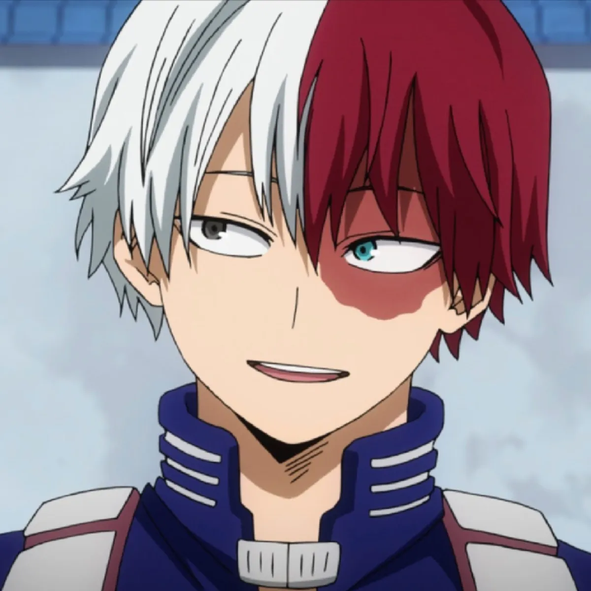
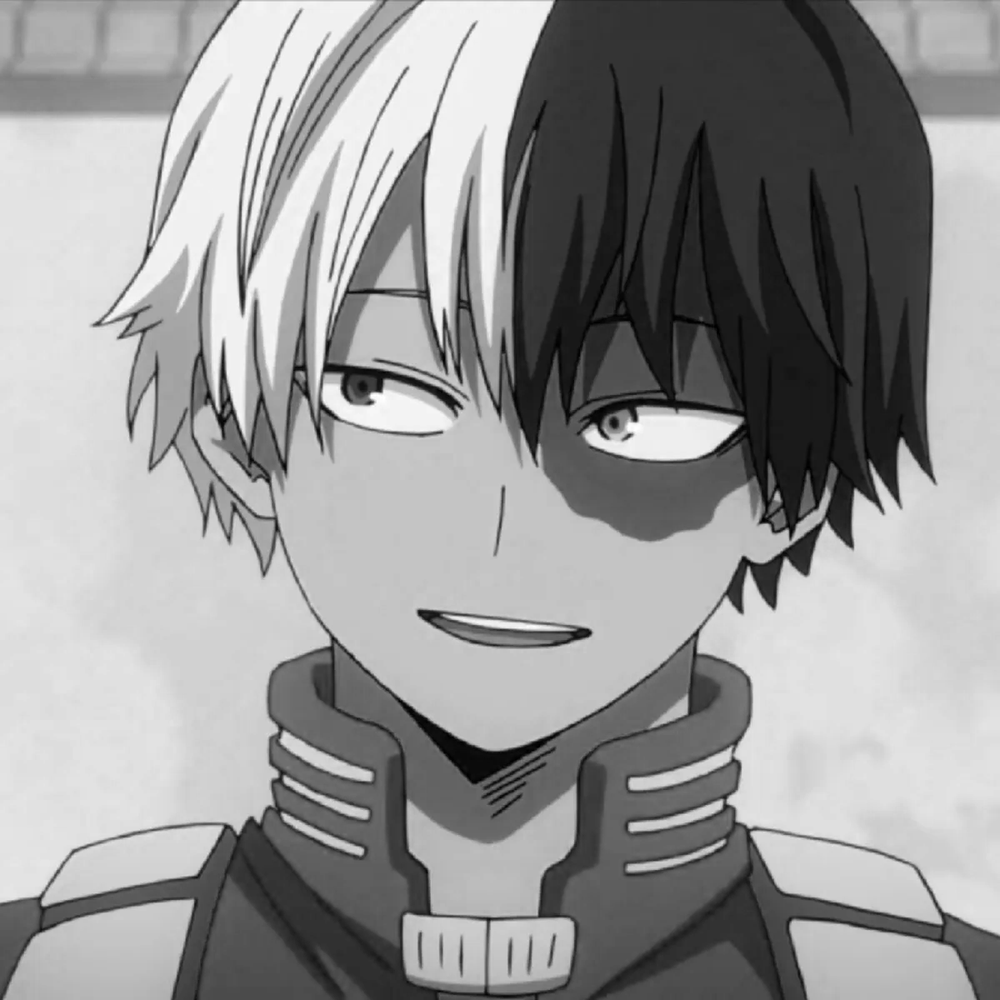
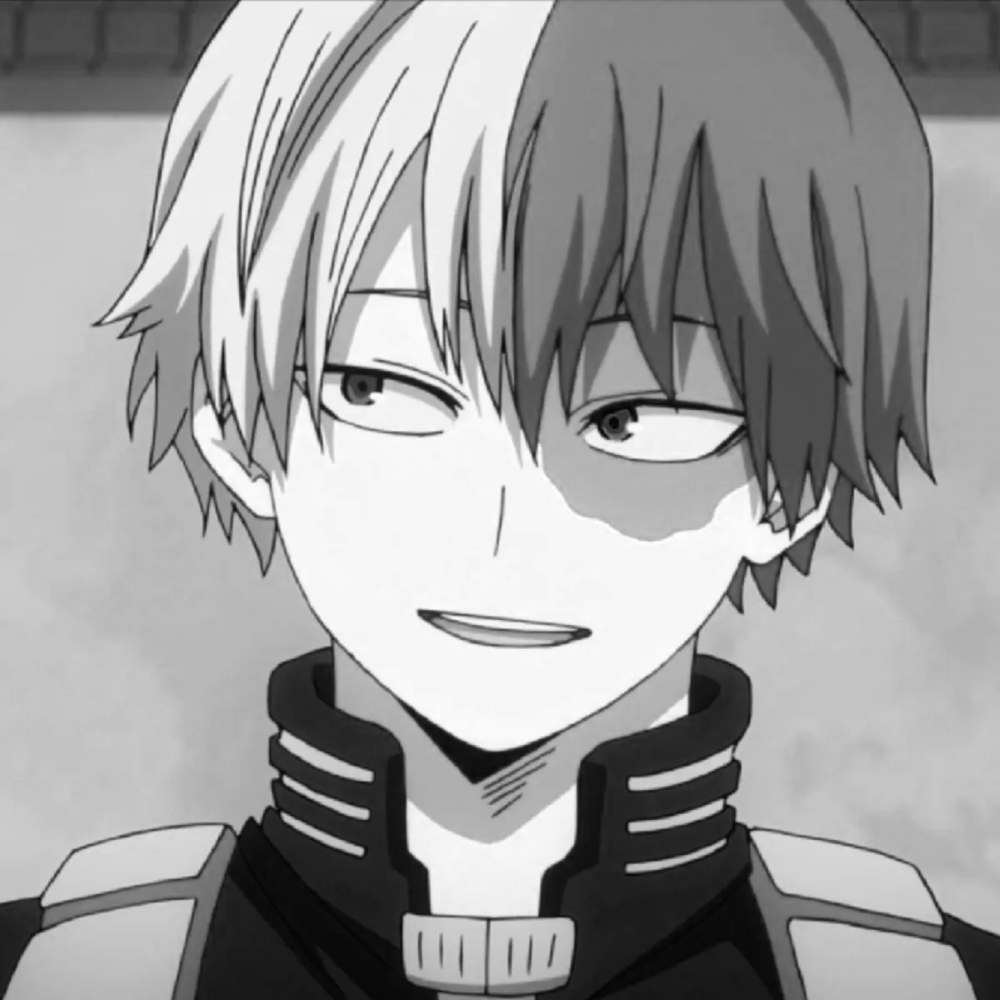
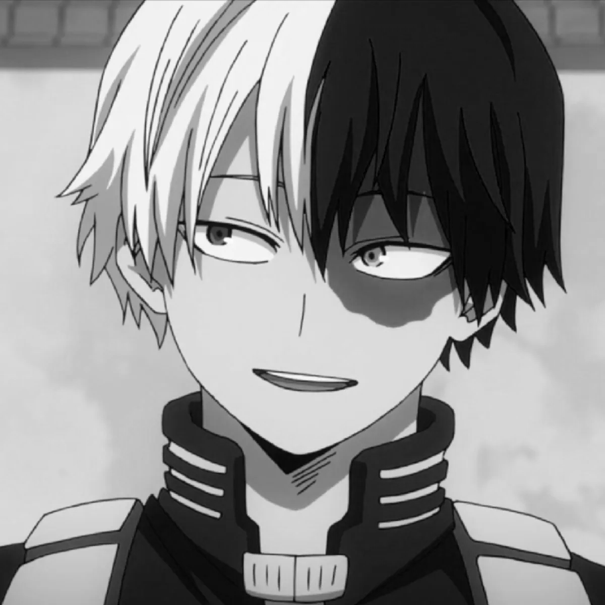
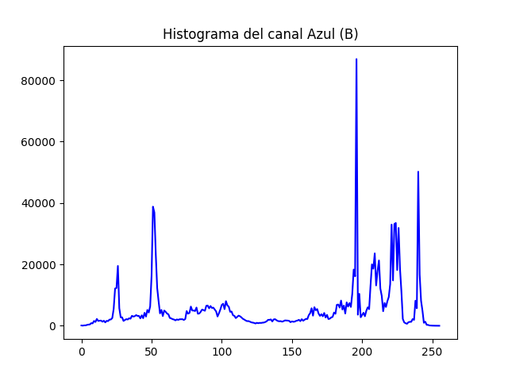
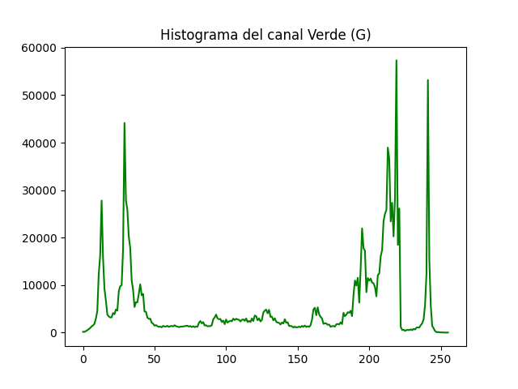
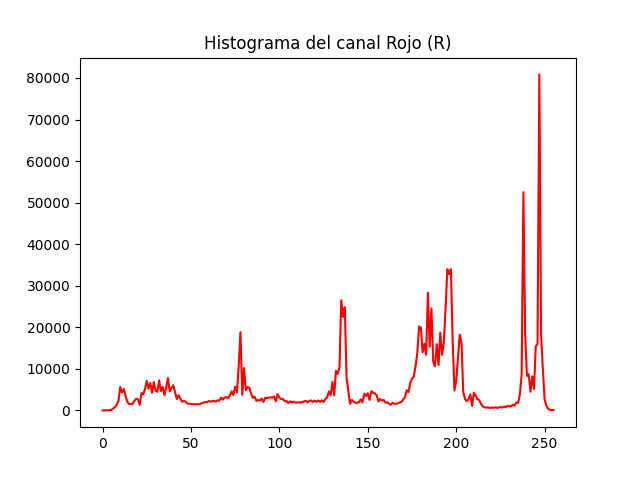
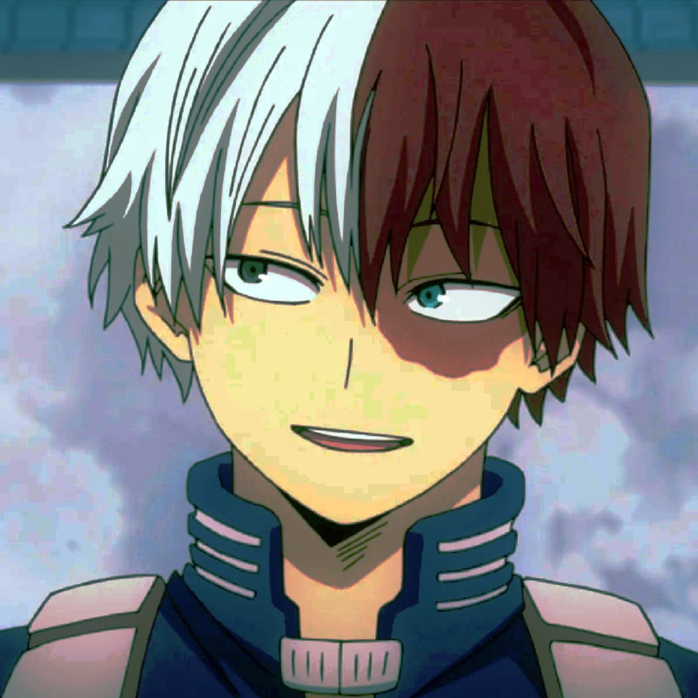
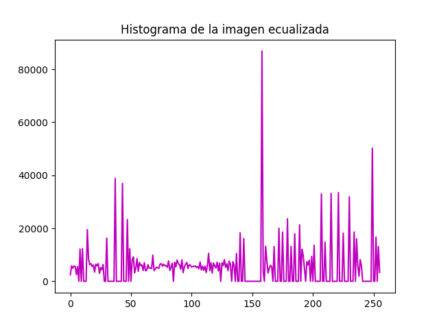

--- Reporte ---

--- Reporte ---

Imagen a color original:

Imagen en el canal azul:

Imagen en el canal rojo:

Imagen en el canal verde:

Histograma del canal Azul (B):

Histograma del canal Verde (G):

Histograma del canal Rojo (R):

Imagen ecualizada:

Histograma de la imagen ecualizada:

