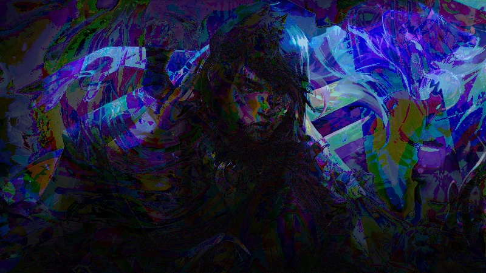

--- Reporte ---

Imagenes originales:
Imagen 1:

Imagen 2:

Operaciones aritmeticas:
- Suma de imagenes:

- Resta de imagenes:

- Multiplicacion de imagenes:

Operaciones a nivel de bits:
- Operación bitwise AND:

- Operación bitwise OR:

- Operación bitwise XOR:

